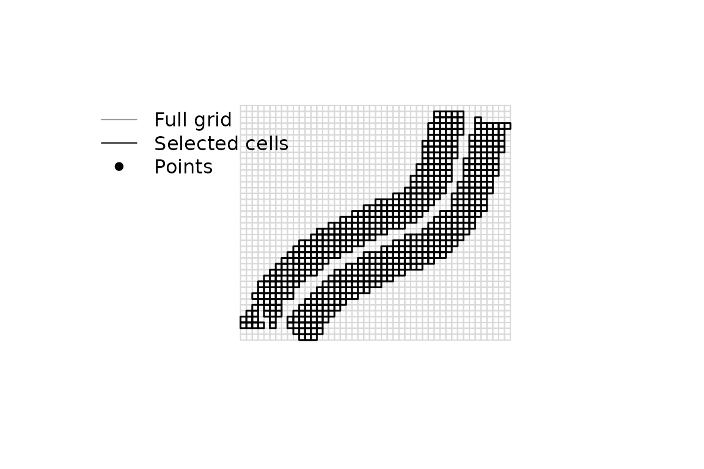

# Getting started with ofemeantest

`ofemeantest` implements a cell-based, permutation-based protocol to
compare treatments in **unreplicated on-farm experiments** (OFE) where
strips of management are laid out side-by-side over a field and yield is
recorded densely (e.g., from a yield monitor).

The package handles three things:

1.  **Build a regular grid** over the trial and aggregate the dense
    point data into cell-level medians, keeping only cells that fall
    inside a single treatment strip and contain enough observations.
2.  **Estimate the effective sample size (ESS)** from the spatial
    autocorrelation of the residuals of a one-way ANOVA on cell medians,
    to avoid pseudo-replication from spatially correlated data.
3.  **Test treatment differences** with a permutational ANOVA, repeated
    over many random subsamples of size ESS, and report the median
    *p*-value as the field-specific test result.

## Installation

``` r

# install.packages("pak")
pak::pkg_install("PPaccioretti/ofemeantest")
```

## A worked example

The bundled `ofe_f2` dataset comes from a corn (Zea mays L.) trial where
a single fertilized strip (~2.2 ha) was compared against an adjacent
control strip on the same field. Raw yield-monitor data were cleaned
following Vega et al. (2019).

``` r

library(ofemeantest)
data("ofe_f2")

head(ofe_f2)
#>    Treatment Yield_tn                geom
#> 1 Fertilized 7.915459 388594.8, 6370076.9
#> 2 Fertilized 7.984485 388595.5, 6370078.5
#> 3 Fertilized 6.685809 388596.3, 6370080.2
#> 4 Fertilized 6.265568 388597.2, 6370081.8
#> 5 Fertilized 5.508421     388598, 6370083
#> 6 Fertilized 4.486158 388598.8, 6370085.0
```

### Quick run

Call
[`ofemt()`](https://ppaccioretti.github.io/ofemeantest/reference/ofemt.md)
and let it build the grid internally:

``` r

res <- ofemt(
  data = ofe_f2,
  y = "Yield_tn",
  x = "Treatment",
  cellsize = 9,
  min_per_cell = 4,
  n_p = 2000,
  n_s = 200,
  alpha = 0.05
)
res
#> 
#> === OFE permutation analysis ===
#> Cellsize: 9_9 | Selected cells: 554
#> Obs/cell (min/median/max): 4 / 5 / 7
#> n: 554 | ESS: 97 | Rho: 0.652 | Moran's I: 0.548
#> 
#> --- Means comparison ---
#>   Treatment Yield_tn_mean letters
#>  Fertilized      5.280402       b
#>     Control      4.760095      a 
#> 
#> --- Pairwise tests (median p-value across runs, corrected p-value) ---
#>              Comparison p_value  p_adj
#>  Control vs. Fertilized  0.0035 0.0035
```

Key fields in the printed result:

- **Selected cells**: cells retained after filtering by single treatment
  and `min_per_cell`.
- **n / ESS**: nominal sample size and effective sample size given the
  spatial autocorrelation of the residuals.
- **Rho / Moran’s I**: spatial autocorrelation indicators.
- **Means comparison**: per-treatment median yield (in cells) and
  compact letter display from the multiple-comparison procedure.
- **ANOVA permutation test**: median *p*-value per pairwise comparison.

### Step-by-step

For finer control — inspecting the grid, tweaking the cell size, or
reusing the same selection in several downstream analyses — build the
grid explicitly with
[`make_ofe_grid()`](https://ppaccioretti.github.io/ofemeantest/reference/make_ofe_grid.md)
and pass it to
[`ofemt()`](https://ppaccioretti.github.io/ofemeantest/reference/ofemt.md).

``` r

g <- make_ofe_grid(
  data = ofe_f2,
  x = "Treatment",
  cellsize = 9,
  min_per_cell = 4
)
names(g)
#> [1] "grid_all"   "grid_sel"   "params"     "cell_stats"


plot_grid_selection(g)
```



``` r


res2 <- ofemt(
  data = ofe_f2,
  y = "Yield_tn",
  x = "Treatment",
  grid = g,
  n_p = 2000,
  n_s = 200
)
```

Both calls produce the same numeric output when the grid is built with
matching arguments — `ofemt(grid = NULL, ...)` is equivalent to
`ofemt(grid = make_ofe_grid(...))` under the hood.

### Reproducibility

[`ofemt()`](https://ppaccioretti.github.io/ofemeantest/reference/ofemt.md)
exposes a `seed` argument that controls the random subsampling inside
the permutation runs. The default is `seed = 7L`, so two calls with the
same inputs return identical p-values:

``` r

identical(
  ofemt(
    ofe_f2,
    y = "Yield_tn",
    x = "Treatment",
    cellsize = 9,
    min_per_cell = 4,
    seed = 7L
  ),
  ofemt(
    ofe_f2,
    y = "Yield_tn",
    x = "Treatment",
    cellsize = 9,
    min_per_cell = 4,
    seed = 7L
  )
)
#> TRUE
```

Pass `seed = NULL` to let results vary across runs (e.g., when exploring
sensitivity to the random draws).

### Inspecting the permutation distribution

Each call retains the per-run *p*-values in `res$perm_runs` so you can
sanity-check that the median *p*-value is not an artefact of a long
tail:

``` r

# Requires the optional 'ggplot2' package.
plot_pvalue_hist(res)
```

## Where to go next

- [`vignette("methodology")`](https://ppaccioretti.github.io/ofemeantest/articles/methodology.md)
  — technical description of the protocol (effective sample size,
  permutational ANOVA, multiplicity adjustment).
- [`?ofemt`](https://ppaccioretti.github.io/ofemeantest/reference/ofemt.md)
  — full argument reference for the main function.
- [`?make_ofe_grid`](https://ppaccioretti.github.io/ofemeantest/reference/make_ofe_grid.md)
  — details on grid construction and selection.

## References

- Córdoba M., Paccioretti P., Balzarini M. (in review). A new method to
  compare treatments in unreplicated on-farm experimentation.
- Griffith, D.A. (2005). Effective geographic sample size in the
  presence of spatial autocorrelation. *Annals of the Association of
  American Geographers* 95(4): 740–760.
- Vega A., Córdoba M., Balzarini M. (2019). Protocol for automating
  error removal from yield maps. *Precision Agriculture* 20: 1030–1044.
  <https://doi.org/10.1007/s11119-018-09632-8>
