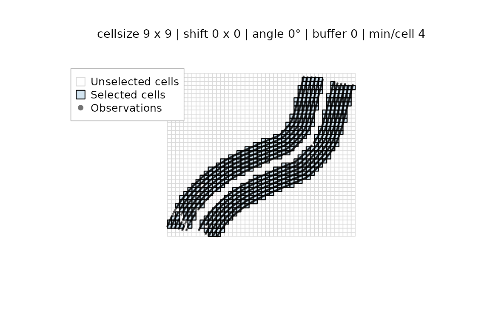

# Getting started with ofemeantest

`ofemeantest` implements a cell-based, permutation-based protocol to
compare treatments in **unreplicated on-farm experiments** (OFE) where
strips of management are laid out side-by-side over a field and yield is
recorded densely (e.g., from a yield monitor).

The package handles three things:

1.  **Build a regular grid** over the trial and aggregate the dense
    point data into cell-level medians, keeping only cells that fall
    inside a single treatment strip and contain enough observations.
2.  **Estimate the effective sample size (ESS)** from the spatial
    autocorrelation of the residuals of a one-way ANOVA on cell medians,
    to avoid pseudo-replication from spatially correlated data.
3.  **Test treatment differences** with a permutational ANOVA, repeated
    over many random subsamples of size ESS, and report the median
    *p*-value as the field-specific test result.

## Installation

``` r

# install.packages("pak")
pak::pkg_install("PPaccioretti/ofemeantest")
```

## A worked example

The bundled `ofe_f2` dataset comes from a corn (Zea mays L.) trial where
a single fertilized strip (~2.2 ha) was compared against an adjacent
control strip on the same field. Raw yield-monitor data were cleaned
following Vega et al. (2019).

``` r

library(ofemeantest)
data("ofe_f2")

head(ofe_f2)
#>    Treatment Yield_tn                geom
#> 1 Fertilized 7.915459 388594.8, 6370076.9
#> 2 Fertilized 7.984485 388595.5, 6370078.5
#> 3 Fertilized 6.685809 388596.3, 6370080.2
#> 4 Fertilized 6.265568 388597.2, 6370081.8
#> 5 Fertilized 5.508421     388598, 6370083
#> 6 Fertilized 4.486158 388598.8, 6370085.0
```

### Quick run

Call
[`ofemt()`](https://ppaccioretti.github.io/ofemeantest/reference/ofemt.md)
and let it build the grid internally:

``` r

res <- ofemt(
  data = ofe_f2,
  y = "Yield_tn",
  x = "Treatment",
  cellsize = 9,
  min_per_cell = 4,
  n_p = 2000,
  n_s = 200,
  alpha = 0.05
)
res
#> 
#> === OFE permutation analysis ===
#> Cellsize: 9 x 9 | Total cells: 1840 | Selected cells: 554
#> Obs/cell (min/median/max): 4 / 5 / 7
#> n: 554 | ESS: 97 | Rho: 0.652 | Moran's I: 0.548
#> 
#> --- Means comparison (sorted by decreasing mean) ---
#>   Treatment Yield_tn_mean letters
#>  Fertilized      5.280402      a 
#>     Control      4.760095       b
#> 
#> --- Pairwise tests (median p across runs) ---
#>              Comparison p_value  p_adj
#>  Fertilized vs. Control  0.0055 0.0055
```

Key fields in the printed result:

- **Selected cells**: cells retained after filtering by single treatment
  and `min_per_cell`.
- **n / ESS**: nominal sample size and effective sample size given the
  spatial autocorrelation of the residuals.
- **Rho / Moran’s I**: spatial autocorrelation indicators.
- **Means comparison**: per-treatment median yield (in cells) and
  compact letter display from the multiple-comparison procedure.
- **ANOVA permutation test**: median *p*-value per pairwise comparison.

### Step-by-step

For finer control — inspecting the grid, tweaking the cell size, or
reusing the same selection in several downstream analyses — build the
grid explicitly with
[`make_ofe_grid()`](https://ppaccioretti.github.io/ofemeantest/reference/make_ofe_grid.md)
and pass it to
[`ofemt()`](https://ppaccioretti.github.io/ofemeantest/reference/ofemt.md).

``` r

g <- make_ofe_grid(
  data = ofe_f2,
  x = "Treatment",
  cellsize = 9,
  min_per_cell = 4
)
names(g)
#> [1] "grid_all"   "grid_sel"   "params"     "cell_stats"


plot_grid_selection(g, data = ofe_f2)
```



``` r


res2 <- ofemt(
  data = ofe_f2,
  y = "Yield_tn",
  x = "Treatment",
  grid = g,
  n_p = 2000,
  n_s = 200
)
```

Both calls produce the same numeric output when the grid is built with
matching arguments — `ofemt(grid = NULL, ...)` is equivalent to
`ofemt(grid = make_ofe_grid(...))` under the hood.

### Tuning the grid

[`plot_grid_selection()`](https://ppaccioretti.github.io/ofemeantest/reference/plot_grid_selection.md)
draws the three layers on one set of axes: the full grid in grey, the
cells that survived the filters shaded in blue, and the observations as
points. Overlaying the points on the cell boundaries is what makes the
geometric arguments legible — a cell is dropped either because it
straddles two treatments or because too few points landed inside it, and
both are visible at a glance.

By default the plot is built with **ggplot2**, which keeps the legend
outside the panel — it can never land on top of the data, and the result
does not change with the size of the graphics device. Pass
`engine = "base"` for base graphics instead; if ggplot2 is not
installed, that is what you get anyway, with a message. Because the
ggplot2 engine returns a `ggplot` object, you can keep customising it:

``` r

plot_grid_selection(g, data = ofe_f2) +
  ggplot2::labs(subtitle = "Lote 2, campaña 21/22")

plot_grid_selection(g, data = ofe_f2, engine = "base")
```

With dense yield-monitor data the observations can swamp the cell
boundaries; lower `point_size` until the grid shows through.

The title of each plot repeats the parameters used, so successive calls
can be compared directly:

``` r

op <- par(mfrow = c(1, 2))
plot_grid_selection(
  make_ofe_grid(ofe_f2, x = "Treatment", cellsize = 9, min_per_cell = 4),
  data = ofe_f2
)
# Shift the origin by half a cell and rotate to follow the strips
plot_grid_selection(
  make_ofe_grid(
    ofe_f2,
    x = "Treatment",
    cellsize = 9,
    min_per_cell = 4,
    shift = c(4.5, 4.5),
    angle_deg = 10,
    buffer = 5
  ),
  data = ofe_f2
)
par(op)
```

### Keeping the geometries in the result

By default
[`ofemt()`](https://ppaccioretti.github.io/ofemeantest/reference/ofemt.md)
returns tables only. Set `keep_components` to embed the spatial objects
in the result, which lets you plot the analysis that actually ran rather
than rebuilding the grid by hand:

| `keep_components` | Adds to the result | [`plot()`](https://rdrr.io/r/graphics/plot.default.html) shows |
|----|----|----|
| `"none"` (default) | nothing | *(errors — no geometries)* |
| `"light"` | `grid`, the full `ofe_grid` (`grid_all`, `grid_sel`, `cell_stats`, `params`) | grid + selected cells |
| `"full"` | `"light"` plus `cell_medians` (one point per selected cell, with its median response and ANOVA residual) and `points_joined` (every observation with its `CellID`) | grid + selected cells + points |

Cost scales accordingly: `"light"` stores one polygon per grid cell,
`"full"` adds one row per observation.

``` r

res_full <- ofemt(
  ofe_f2,
  y = "Yield_tn",
  x = "Treatment",
  cellsize = 9,
  min_per_cell = 4,
  keep_components = "full"
)

# No further arguments needed — every layer comes from the object itself
plot(res_full)

# The per-cell medians and residuals that fed the spatial diagnostics
head(res_full$cell_medians)
```

### Reproducibility

[`ofemt()`](https://ppaccioretti.github.io/ofemeantest/reference/ofemt.md)
exposes a `seed` argument that controls the random subsampling inside
the permutation runs. The default is `seed = 7L`, so two calls with the
same inputs return identical p-values:

``` r

identical(
  ofemt(
    ofe_f2,
    y = "Yield_tn",
    x = "Treatment",
    cellsize = 9,
    min_per_cell = 4,
    seed = 7L
  ),
  ofemt(
    ofe_f2,
    y = "Yield_tn",
    x = "Treatment",
    cellsize = 9,
    min_per_cell = 4,
    seed = 7L
  )
)
#> TRUE
```

Pass `seed = NULL` to let results vary across runs (e.g., when exploring
sensitivity to the random draws).

### Inspecting the permutation distribution

Each call retains the per-run *p*-values in `res$perm_runs` so you can
sanity-check that the median *p*-value is not an artefact of a long
tail. `perm_runs` has one row per comparison per sampling run, with
columns `Comparison`, `p_value` (that run’s permutation *p*-value),
`p_adj` (the same value after adjusting for multiplicity *within* the
run) and `run`.

[`plot_pvalue_hist()`](https://ppaccioretti.github.io/ofemeantest/reference/plot_pvalue_hist.md)
draws that distribution with two reference lines per panel: a solid line
at the median — the value reported in the `ANOVA permutation test` table
— and a dashed line at `alpha`.

``` r

# Requires the optional 'ggplot2' package.
plot_pvalue_hist(res)
```

When the analysis was run with a multiplicity adjustment, the histogram
shows the *adjusted* values by default, so the median line and the
reported `p_adj` always refer to the same quantity. Use `which = "raw"`
to see the unadjusted distribution instead:

``` r

res_bonf <- ofemt(
  ofe_f2,
  y = "Yield_tn",
  x = "Treatment",
  cellsize = 9,
  min_per_cell = 4,
  p_adjust_method = "bonferroni"
)

plot_pvalue_hist(res_bonf) # adjusted
plot_pvalue_hist(res_bonf, which = "raw") # unadjusted
```

## Where to go next

- [`vignette("methodology")`](https://ppaccioretti.github.io/ofemeantest/articles/methodology.md)
  — technical description of the protocol (effective sample size,
  permutational ANOVA, multiplicity adjustment).
- [`?ofemt`](https://ppaccioretti.github.io/ofemeantest/reference/ofemt.md)
  — full argument reference for the main function.
- [`?make_ofe_grid`](https://ppaccioretti.github.io/ofemeantest/reference/make_ofe_grid.md)
  — details on grid construction and selection.

## References

- Córdoba, M., Paccioretti, P., & Balzarini, M. (2025). A new method to
  compare treatments in unreplicated on-farm experimentation. Precision
  Agriculture, 26(1), 4. <https://doi.org/10.1007/s11119-024-10206-0>
- Griffith, D.A. (2005). Effective geographic sample size in the
  presence of spatial autocorrelation. *Annals of the Association of
  American Geographers* 95(4): 740–760.
- Vega A., Córdoba M., Balzarini M. (2019). Protocol for automating
  error removal from yield maps. *Precision Agriculture* 20: 1030–1044.
  <https://doi.org/10.1007/s11119-018-09632-8>
